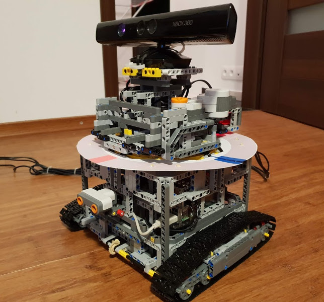

# K.O.C - Kinect on Caterpillar

## Hardware
### B.O.M.
- [Lego 8547](https://www.google.pl/search?q=lego+8547)
- [Lego 42055](https://www.google.pl/search?q=lego+42055)
- [kinect xbox 360](https://www.google.pl/search?q=kinect+xbox+360)
- [brick pi](https://www.dexterindustries.com/brickpi/)
- [raspberry pi 3](https://www.google.pl/search?q=raspberry+pi+3)

### Pictures


[](https://www.youtube.com/watch?v=l-SW-rKROMY)

## installation
Append to `/boot/config.txt`
```bash
# uncomment both if you are using BrickPi or BrickPi+
dtoverlay=brickpi
init_uart_clock=32000000
# uncomment only if you are using BrickPi+
dtparam=brickpi_battery=okay
```

Within a virtualenv run
```bash
./install_dependencies.sh $(virtualenvwrapper_get_site_packages_dir)
```

## ui
Use `pyuic5` to convert Qt5 designer files to python files.

## resources
### pyqt
http://zetcode.com/gui/qt5/
https://www.safaribooksonline.com/videos/python-gui-programming/9781788471268

### zmq  
https://pyzmq.readthedocs.io  
http://zguide.zeromq.org/py:all  
