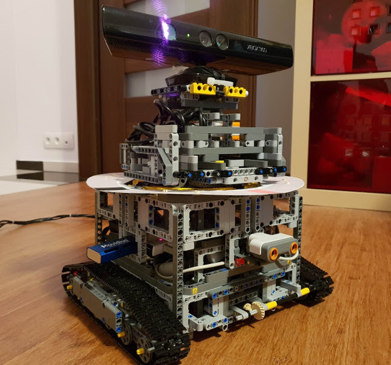
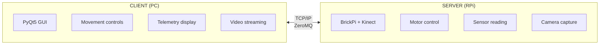

# K.O.C - Kinect on Caterpillar

A remote-controlled LEGO robot featuring caterpillar tracks, a rotating turret, and Xbox 360 Kinect vision — powered by Raspberry Pi 3 and BrickPi+.




[](https://www.youtube.com/watch?v=l-SW-rKROMY)

## Features

- **Caterpillar drive** with differential steering (pivot turns, curves)
- **Rotating turret** with mounted Kinect sensor
- **Real-time video streaming** (RGB + depth) from Kinect
- **Telemetry display**: motor encoders, sensors, battery voltage, CPU temperature
- **PyQt5 GUI** for remote control from any PC
- **ZeroMQ networking** for low-latency communication

## Hardware

| Component | Model |
|-----------|-------|
| Computer | [Raspberry Pi 3](https://www.raspberrypi.org/products/raspberry-pi-3-model-b/) |
| Motor Interface | [BrickPi+](https://www.dexterindustries.com/brickpi/) |
| Camera | [Xbox 360 Kinect](https://en.wikipedia.org/wiki/Kinect) |
| Motors & Sensors | [LEGO 8547 Mindstorms NXT 2.0](https://www.bricklink.com/v2/catalog/catalogitem.page?S=8547-1) |
| Chassis | [LEGO 42055 Bucket Wheel Excavator](https://www.bricklink.com/v2/catalog/catalogitem.page?S=42055-1) (tracks) |

See [Hardware Documentation](doc/hardware.md) for wiring details.

## Quick Start

### Client (PC/Mac/Linux)

```bash
# Clone and setup
git clone https://github.com/your-repo/rpi_lego_robot.git
cd rpi_lego_robot
./scripts/setup-client.sh

# Run the GUI
source .venv/bin/activate
python gui.py
```

Enter the robot's IP address and click **Connect**.

### Server (Raspberry Pi)

1. Configure Raspberry Pi (add to `/boot/config.txt`):
   ```bash
   dtoverlay=brickpi
   init_uart_clock=32000000
   dtparam=brickpi_battery=okay
   ```

2. Install dependencies:
   ```bash
   git clone https://github.com/your-repo/rpi_lego_robot.git
   cd rpi_lego_robot
   ./scripts/setup-server.sh
   ```

3. Run the server:
   ```bash
   source .venv/bin/activate
   python server.py
   ```

See [Raspberry Pi Setup Guide](doc/raspberry-pi-setup.md) for detailed instructions.

### Legacy Setup (Deprecated)

The old `install_dependencies.sh` script is still available but deprecated.
Use the new `scripts/setup-*.sh` scripts which use [uv](https://github.com/astral-sh/uv) for faster, more reliable package management.

## Architecture



See [Architecture Documentation](doc/architecture.md) for detailed design.

## Controls

| Control | Action |
|---------|--------|
| ↑ Forward | Both tracks forward |
| ↓ Backward | Both tracks reverse |
| ← Turn Left | Pivot turn (tracks opposite) |
| → Turn Right | Pivot turn (tracks opposite) |
| ↖ Curve Left | Differential steering |
| ↗ Curve Right | Differential steering |
| Turret Left/Right | Rotate camera mount |
| Speed Slider | Adjust motor power (0-255) |

## Documentation

| Document | Description |
|----------|-------------|
| [Architecture](doc/architecture.md) | System design and data flow |
| [Hardware](doc/hardware.md) | Wiring, sensors, and configuration |
| [Networking](doc/networking.md) | Protocol and packet formats |
| [Project Structure](doc/development/project-structure.md) | Code organization |
| [Raspberry Pi Setup](doc/raspberry-pi-setup.md) | OS setup, dependencies, troubleshooting |
| [NCS Legacy Support](doc/ncs-legacy-support.md) | Intel Movidius Neural Compute Stick |
| [Dependency Management](doc/development/todo-dependency-management.md) | Setup scripts and requirements |

## Dependencies

### Requirements Structure

```
requirements/
├── base.txt    # Shared: numpy, pyzmq, PyYAML, netifaces
├── client.txt  # Desktop GUI: PyQt5, pyqtgraph, opencv-python
└── server.txt  # Raspberry Pi: smbus2, psutil
```

### Native Libraries (Git Submodules)

| Submodule | Purpose |
|-----------|---------|
| `dependencies/BrickPi` | LEGO motor/sensor interface |
| `dependencies/libfreenect` | Xbox Kinect driver |
| `dependencies/ncsdk` | Intel NCS SDK (legacy) |
| `dependencies/ncappzoo` | Pre-trained neural network models |

Initialize submodules:
```bash
git submodule init
git submodule update
```

### Intel NCS (Legacy Device)

The Intel Movidius Neural Compute Stick is supported but considered legacy hardware.
See [NCS Legacy Support](doc/ncs-legacy-support.md) for details.

## Resources

### Documentation
- [PyQt5 Tutorial](http://zetcode.com/gui/pyqt5/)
- [ZeroMQ Guide](http://zguide.zeromq.org/py:all)
- [PyZMQ Docs](https://pyzmq.readthedocs.io)
- [BrickPi Documentation](https://www.dexterindustries.com/BrickPi/brickpi-tutorials-documentation/)
- [OpenKinect](https://openkinect.org/)

## License

See [LICENSE](LICENSE) file.
