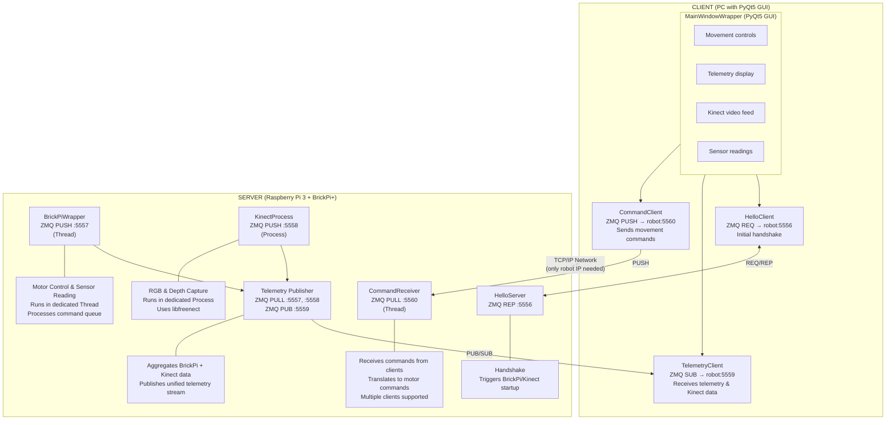
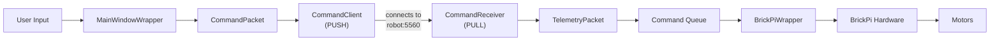
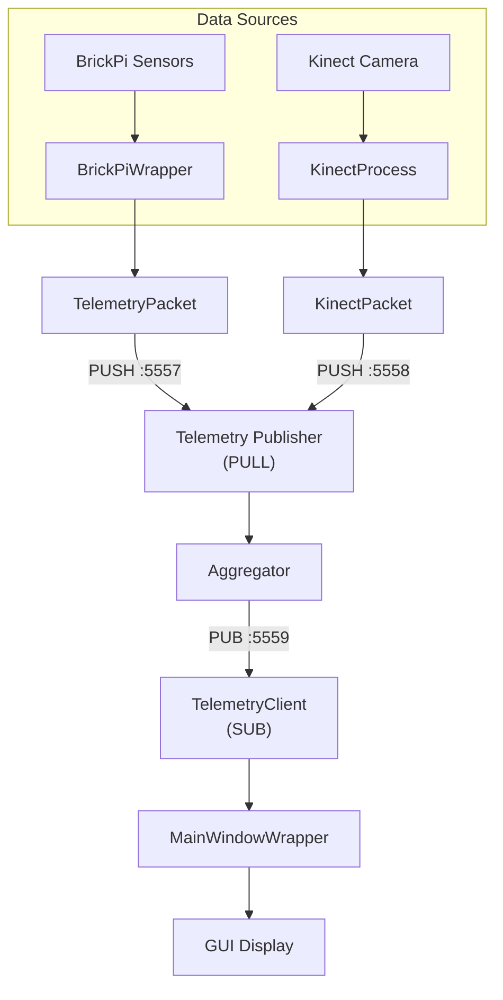

# System Architecture

K.O.C (Kinect on Caterpillar) uses a distributed client-server architecture with ZeroMQ for high-performance messaging.

## Overview

## Design Principles

1. **Client only needs robot IP** — all connections flow from client to robot
2. **Multiple clients supported** — robot accepts commands from any connected client
3. **No reverse connections** — robot never dials back to client

## ZeroMQ Patterns

The system uses three ZeroMQ messaging patterns:

### REQ/REP (Request-Reply)
- **Port 5556**: HelloServer ↔ HelloClient
- Used for initial handshake
- Triggers hardware startup on first client connection

### PUB/SUB (Publish-Subscribe)
- **Port 5559**: Server → Clients (telemetry stream)
- One-to-many broadcast of sensor data and video

### PUSH/PULL (Pipeline)
- **Port 5560**: Clients → Server (commands)
- **Port 5557**: BrickPiWrapper → Telemetry Publisher (internal)
- **Port 5558**: KinectProcess → Telemetry Publisher (internal)

## Data Flow

### Startup Sequence

1. Server starts and binds all ports (:5556, :5559, :5560)
2. CommandReceiver starts immediately (no client dependency)
3. Client GUI launches and enters robot IP
4. Client connects to robot on all ports
5. HelloClient triggers BrickPi and Kinect startup on first connection
6. Data flows begin

### Command Flow (Client → Server)

### Telemetry Flow (Server → Client)

## Threading Model

| Component | Type | Purpose |
|-----------|------|---------|
| HelloServer | Thread (daemon) | Connection handshake |
| CommandReceiver | Thread (daemon) | Receive commands from clients |
| BrickPiWrapper | Thread (daemon) | Motor/sensor I/O |
| KinectProcess | Process (daemon) | Camera capture (CPU-intensive) |
| Telemetry Publisher | Main thread | Data aggregation |

The Kinect runs in a separate **Process** rather than a Thread to avoid GIL contention during image processing.

## Configuration

### Network Ports

| Port | Protocol | Direction | Purpose |
|------|----------|-----------|---------|
| 5556 | REQ/REP | Client → Robot | Hello/Handshake |
| 5557 | PUSH/PULL | Internal | BrickPi → Aggregator |
| 5558 | PUSH/PULL | Internal | Kinect → Aggregator |
| 5559 | PUB/SUB | Robot → Clients | Telemetry broadcast |
| 5560 | PUSH/PULL | Clients → Robot | Command input |

### Timing

- BrickPi update clock: 100ms (configurable)
- Temperature/voltage polling: Every 50 cycles (~5 seconds)
- HelloServer sleep: 1 second between heartbeats
