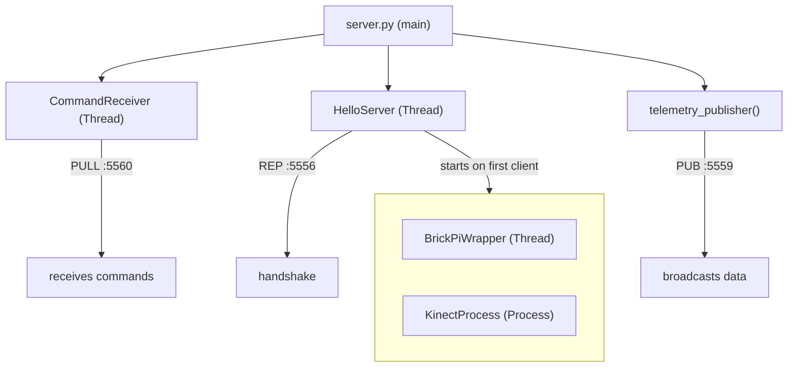
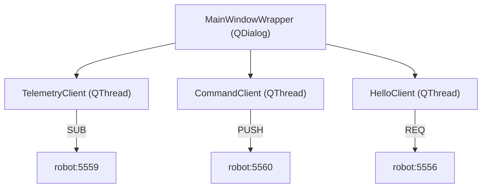

# Project Structure

## Directory Layout

```
rpi_lego_robot/
├── gui.py                    # Client entry point (PyQt5 GUI)
├── server.py                 # Server entry point (Raspberry Pi)
├── logging.yml               # Logging configuration
├── install_dependencies.sh   # Dependency installation script
├── sync.sh                   # Deployment script
│
├── app/                      # Main application package
│   ├── __init__.py
│   │
│   ├── client/               # Client-side modules
│   │   ├── __init__.py
│   │   ├── HelloClient.py    # Connection handshake client
│   │   └── gui/              # PyQt5 GUI components
│   │       ├── __init__.py
│   │       ├── main_window.py      # Generated UI code (from .ui)
│   │       ├── main_window.ui      # Qt Designer file
│   │       ├── MainWindowWrapper.py # GUI logic & event handlers
│   │       └── images/             # Button icons
│   │           ├── up.png
│   │           ├── down.png
│   │           ├── left.png
│   │           ├── right.png
│   │           ├── round_left.png
│   │           └── round_right.png
│   │
│   ├── server/               # Server-side modules
│   │   ├── __init__.py
│   │   ├── HelloServer.py    # Connection handshake server
│   │   ├── BrickPiWrapper.py # Motor/sensor controller
│   │   ├── KinectProcess.py  # Camera capture process
│   │   └── CommandReceiver.py # Receives commands from clients (PULL)
│   │
│   ├── Networking/           # Protocol definitions
│   │   ├── __init__.py       # Network utilities
│   │   ├── Packet.py         # Base packet class
│   │   ├── HelloPacket.py    # Handshake packets
│   │   ├── CommandPacket.py  # Movement commands
│   │   ├── TelemetryPacket.py # Sensor/motor state
│   │   └── KinectPacket.py   # Video/depth frames
│   │
│   └── common/               # Shared utilities
│       ├── __init__.py
│       ├── LoggingWrapper.py # Logging setup
│       ├── Misc.py           # Serialization helpers
│       └── ControlPacket.py  # (Legacy/unused)
│
├── dependencies/             # External dependencies
│   ├── 55-i2c.rules         # udev rules for I²C
│   ├── 66-kinect.rules      # udev rules for Kinect
│   ├── BrickPi/             # BrickPi library (git submodule)
│   └── libfreenect/         # Kinect library (git submodule)
│
├── testing/                  # Test scripts
│   ├── __init__.py
│   ├── brickpi/             # BrickPi hardware tests
│   │   ├── BrickPi+_Read_Battery_Voltage.py
│   │   ├── freenect_test.py
│   │   ├── LEGO-Color_Sensor_Test.py
│   │   ├── LEGO-Encoder_Test.py
│   │   ├── ultrasonic_test.py
│   │   ├── system_temperature.py
│   │   └── requirements.txt
│   ├── pyqt5_tests/         # PyQt5 examples
│   └── zeromq/              # ZeroMQ examples
│
├── pictures/                 # Project photos
│   ├── pic1.jpg
│   └── pic2.jpg
│
└── doc/                      # Documentation
    ├── architecture.md
    ├── hardware.md
    ├── networking.md
    └── development/
        ├── project-structure.md
        └── refactor-networking.md
```

## Module Responsibilities

### Entry Points

| File | Platform | Description |
|------|----------|-------------|
| `gui.py` | PC (any OS) | Launches PyQt5 control interface |
| `server.py` | Raspberry Pi | Starts robot server components |

### app/client/

| Module | Description |
|--------|-------------|
| `HelloClient.py` | ZMQ REQ client for server handshake |
| `gui/MainWindowWrapper.py` | Main GUI controller with signal/slot handlers |
| `gui/main_window.py` | Auto-generated from `main_window.ui` |

### app/server/

| Module | Description |
|--------|-------------|
| `HelloServer.py` | Accepts client connections, starts BrickPi/Kinect |
| `BrickPiWrapper.py` | Thread managing motors, sensors, telemetry |
| `KinectProcess.py` | Process capturing RGB and depth frames |
| `CommandReceiver.py` | PULL socket receiving commands from clients |

### app/Networking/

| Module | Description |
|--------|-------------|
| `Packet.py` | Base class with sequence and timestamp |
| `HelloPacket.py` | `HelloClientPacket`, `HelloServerPacket` |
| `CommandPacket.py` | Movement commands and subclasses |
| `TelemetryPacket.py` | `TelemetryPacket`, `LegoMotor`, `LegoSensor` |
| `KinectPacket.py` | Video and depth frame container |

### app/common/

| Module | Description |
|--------|-------------|
| `LoggingWrapper.py` | YAML-based logging configuration |
| `Misc.py` | `compress()`, `decompress()` with pickle protocol 4 |

## Key Classes

### Server Side



### Client Side



## UI Development

The GUI is built with Qt Designer:

1. Edit `app/client/gui/main_window.ui` in Qt Designer
2. Regenerate Python code:
   ```bash
   pyuic5 app/client/gui/main_window.ui -o app/client/gui/main_window.py
   ```
3. Logic resides in `MainWindowWrapper.py` (not regenerated)

## Dependencies Management

### Git Submodules

```bash
# Initialize submodules
git submodule init
git submodule update
```

Submodules:
- `dependencies/BrickPi` - Dexter Industries BrickPi library
- `dependencies/libfreenect` - OpenKinect driver

### Python Dependencies

Core dependencies (no requirements.txt at root):
- `numpy` - Array operations
- `smbus2` - I²C communication (server only)
- `pyzmq` - ZeroMQ bindings
- `pyyaml` - Logging config
- `netifaces` - Network interface info
- `pyqt5` - GUI framework (client only)
- `freenect` - Kinect driver (server only, built from source)
- `BrickPi` - Motor controller (server only, from submodule)

**Note**: `opencv-python` is no longer required for the client.

## Code Conventions

### Naming
- Classes: `PascalCase`
- Methods/functions: `snake_case`
- Constants: `UPPER_SNAKE_CASE`
- Private members: `_leading_underscore`

### Patterns
- Properties with `@property` decorators
- Thread/Process subclasses for concurrency
- Qt signals/slots for GUI events
- Context managers for ZMQ cleanup

## Recent Changes (Dec 2024)

### Networking Refactor
- **Removed**: `CommandSubscriber.py` (robot dialing client)
- **Added**: `CommandReceiver.py` (robot accepts connections)
- **Changed**: `CommandServer` → `CommandClient` in GUI
- **Benefit**: Client only needs robot IP, multiple clients supported

### Bug Fixes
- Removed unnecessary `cv2` dependency from GUI
- Fixed pickle protocol for Python 3.7 compatibility (protocol 4)

## Known Issues

1. **Typos**: `turrent` appears in UI (should be `turret`)
2. **No requirements.txt**: Dependencies documented only in install script
3. **Unused code**: `ControlPacket.py` appears unused
