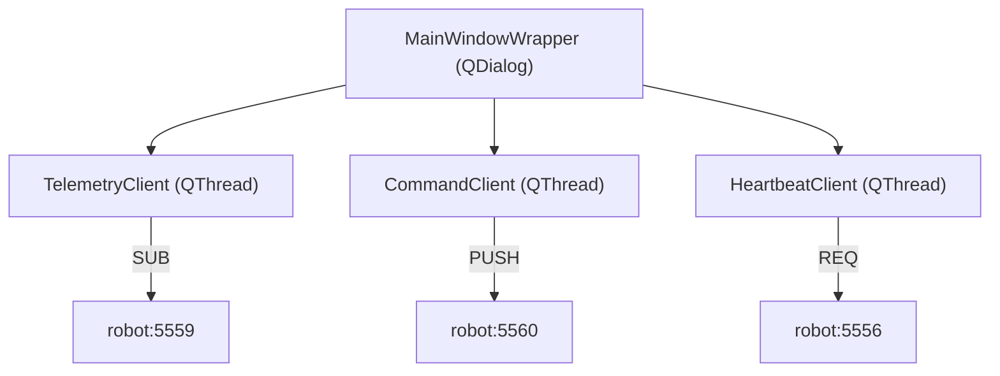

# Project Structure

## Directory Layout

```
rpi_lego_robot/
├── gui.py                    # Client entry point (PyQt5 GUI)
├── server.py                 # Server entry point (Raspberry Pi)
├── logging.yml               # Logging configuration
├── sync.sh                   # Deployment script (rsync to Pi)
│
├── scripts/                  # Setup scripts
│   ├── common.sh             # Shared setup functions
│   ├── setup-client.sh       # Client dependencies (PyQt5, etc.)
│   └── setup-server.sh       # Server dependencies (BrickPi, etc.)
│
├── requirements/             # Python dependencies
│   ├── base.txt              # Shared: numpy, pyzmq, PyYAML, netifaces
│   ├── client.txt            # Desktop: PyQt5, pyqtgraph, opencv-python
│   └── server.txt            # Raspberry Pi: smbus2, psutil
│
├── app/                      # Main application package
│   ├── __init__.py
│   │
│   ├── client/               # Client-side modules
│   │   ├── __init__.py
│   │   ├── heartbeat_client.py   # Heartbeat/keepalive client
│   │   ├── telemetry_client.py   # Receives telemetry & Kinect data
│   │   ├── command_client.py     # Sends movement commands
│   │   ├── connection_manager.py # Connection state management
│   │   ├── frame_processor.py    # Video/depth frame processing
│   │   ├── pointcloud_widget.py  # 3D point cloud visualization
│   │   └── gui/                  # PyQt5 GUI components
│   │       ├── __init__.py
│   │       ├── main_window.py        # UI layout code
│   │       ├── MainWindowWrapper.py  # GUI logic & event handlers
│   │       └── images/               # Button icons
│   │           ├── up.png, down.png, left.png, right.png
│   │           └── round_left.png, round_right.png
│   │
│   ├── server/               # Server-side modules
│   │   ├── __init__.py
│   │   ├── handshake_server.py   # Connection handshake server
│   │   ├── brick_pi_wrapper.py   # Motor/sensor controller
│   │   ├── kinect_process.py     # Camera capture process
│   │   └── command_receiver.py   # Receives commands from clients
│   │
│   ├── networking/           # Protocol definitions
│   │   ├── __init__.py           # Exports all packet classes
│   │   └── packets.py            # All packet class definitions
│   │
│   └── common/               # Shared utilities
│       ├── __init__.py
│       ├── config.py             # Centralized configuration
│       ├── logging_wrapper.py    # Logging setup
│       └── serialization.py      # Compress/decompress helpers
│
├── dependencies/             # External dependencies
│   ├── 55-i2c.rules         # udev rules for I²C
│   ├── 66-kinect.rules      # udev rules for Kinect
│   ├── BrickPi/             # BrickPi library (git submodule)
│   └── libfreenect/         # Kinect library (git submodule)
│
├── testing/                  # Test scripts
│   ├── brickpi/             # BrickPi hardware tests
│   ├── pyqt5_tests/         # PyQt5 examples
│   └── zeromq/              # ZeroMQ examples
│
├── pictures/                 # Project photos
│   ├── pic1.jpg
│   ├── pic2.jpg
│   └── gui.png
│
└── doc/                      # Documentation
    ├── architecture.md       # System design
    ├── hardware.md           # Wiring and sensors
    ├── networking.md         # Protocol details
    ├── raspberry-pi-setup.md # OS setup guide
    ├── ncs-legacy-support.md # Intel NCS (legacy)
    └── development/          # Developer docs
        └── project-structure.md
```

## Module Responsibilities

### Entry Points

| File | Platform | Description |
|------|----------|-------------|
| `gui.py` | PC (any OS) | Launches PyQt5 control interface |
| `server.py` | Raspberry Pi | Starts robot server components |

### app/client/

| Module | Description |
|--------|-------------|
| `heartbeat_client.py` | ZMQ REQ client for server handshake |
| `telemetry_client.py` | ZMQ SUB client for telemetry/Kinect data |
| `command_client.py` | ZMQ PUSH client for movement commands |
| `connection_manager.py` | Manages connection state and client threads |
| `frame_processor.py` | Converts Kinect frames to QImage and point clouds |
| `pointcloud_widget.py` | 3D visualization using pyqtgraph OpenGL |
| `gui/MainWindowWrapper.py` | Main GUI controller with signal/slot handlers |
| `gui/main_window.py` | UI layout and widget definitions |

### app/server/

| Module | Description |
|--------|-------------|
| `handshake_server.py` | Accepts client connections, starts BrickPi/Kinect |
| `brick_pi_wrapper.py` | Thread managing motors, sensors, telemetry |
| `kinect_process.py` | Process capturing RGB and depth frames |
| `command_receiver.py` | PULL socket receiving commands from clients |

### app/networking/

| Module | Description |
|--------|-------------|
| `packets.py` | All packet classes in a single module |

**Packet Classes:**
- `Packet` - Base class with sequence and timestamp
- `HeartbeatPacket`, `HeartbeatRequest`, `HeartbeatResponse` - Handshake packets
- `CommandPacket` and subclasses - Movement commands
- `TelemetryPacket`, `LegoMotor`, `LegoSensor`, `SystemStats` - Telemetry data
- `KinectPacket` - Video and depth frame container

### app/common/

| Module | Description |
|--------|-------------|
| `config.py` | Centralized port numbers and settings |
| `logging_wrapper.py` | YAML-based logging configuration |
| `serialization.py` | `compress()`, `decompress()` with pickle protocol 4 |

## Key Classes

### Server Side


### Client Side



## Dependencies Management

### Git Submodules

```bash
# Initialize submodules
git submodule init
git submodule update
```

Submodules:
- `dependencies/BrickPi` - Dexter Industries BrickPi library
- `dependencies/libfreenect` - OpenKinect driver

### Python Dependencies

Organized in `requirements/` directory:

| File | Platform | Contents |
|------|----------|----------|
| `base.txt` | Both | numpy, pyzmq, PyYAML, netifaces |
| `client.txt` | Desktop | PyQt5, pyqtgraph, opencv-python |
| `server.txt` | Raspberry Pi | smbus2, psutil |

## Code Conventions

### Naming
- Classes: `PascalCase`
- Files/modules: `snake_case`
- Methods/functions: `snake_case`
- Constants: `UPPER_SNAKE_CASE`
- Private members: `_leading_underscore`

### Patterns
- Properties with `@property` decorators
- Thread/Process subclasses for concurrency
- Qt signals/slots for GUI events
- Context managers for ZMQ cleanup

## Deployment

Use `sync.sh` to deploy to Raspberry Pi:

```bash
./sync.sh
```

This uses rsync with `--delete` to mirror the local codebase to the Pi, excluding:
- `.git`, `.venv`, `__pycache__`
- `testing/`, `doc/`, `pictures/`
- Large dependency directories
