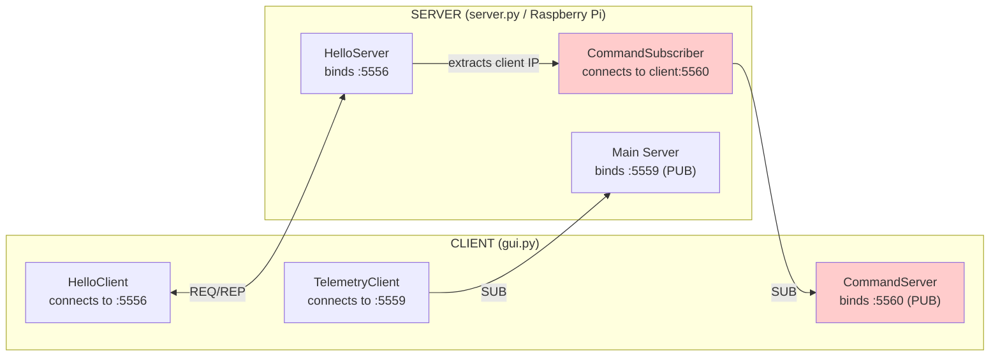
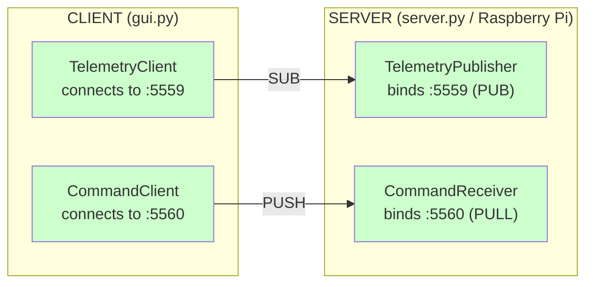

# Networking Refactor Plan

> **Status: ✅ COMPLETED** (December 2025)

## Problem Statement

The current architecture requires the robot to **dial back to the client** to receive commands. This creates several issues:

1. **Client IP discovery fails** when client has multiple network interfaces
2. **Firewall issues** — client must accept incoming connections on port 5560
3. **Inverted responsibility** — robot depends on knowing client's IP address
4. **Single client limitation** — architecture suggests multi-robot, but we want multi-client

## Current Architecture

> ⚠️ **PROBLEM**: Robot dials OUT to client. Requires client IP detection.
> ✓ TelemetryClient pattern is correct.

### Current Port Assignments

| Port | Component | Socket | Direction | Issue |
|------|-----------|--------|-----------|-------|
| 5556 | HelloServer | REP | Robot binds | ✓ OK |
| 5557 | BrickPiWrapper | PUSH | Internal | ✓ OK |
| 5558 | KinectProcess | PUSH | Internal | ✓ OK |
| 5559 | Main Server | PUB | Robot binds | ✓ OK |
| 5560 | CommandServer | PUB | **Client binds** | ✗ Inverted |

## Target Architecture

> ✓ Client only needs robot IP
> ✓ Multiple clients can connect

### Target Port Assignments

| Port | Component | Socket | Direction |
|------|-----------|--------|-----------|
| 5559 | TelemetryPublisher | PUB | Robot binds, clients subscribe |
| 5560 | CommandReceiver | PULL | Robot binds, clients push |

### Why PUSH/PULL for Commands?

- **PUB/SUB** would broadcast commands to all subscribers (not needed)
- **PUSH/PULL** provides fair queuing from multiple clients
- **REQ/REP** would require acknowledgments (unnecessary overhead)

## Refactoring Tasks

### Phase 1: Simplify Server (Robot Side) ✅

#### Task 1.1: Create CommandReceiver (replaces CommandSubscriber) ✅
- [x] Create new `app/server/CommandReceiver.py`
- [x] Use ZMQ PULL socket that BINDS to `:5560`
- [x] No client IP required
- [x] Keep existing `handle_command_packet()` logic

#### Task 1.2: Update server.py ✅
- [x] Replace `CommandSubscriber` with `CommandReceiver`
- [x] Start `CommandReceiver` immediately (no client IP dependency)

#### Task 1.3: Simplify HelloServer ✅
- [x] Remove client IP extraction logic
- [x] Remove `find_client_ip_on_same_subnet()` function
- [x] Remove `command_subscriber` parameter
- [x] HelloServer only manages BrickPi and Kinect startup

### Phase 2: Update Client (GUI Side) ✅

#### Task 2.1: Create CommandClient (replaces CommandServer) ✅
- [x] Rename class from `CommandServer` to `CommandClient`
- [x] Change from PUB (bind) to PUSH (connect)
- [x] Accept `robot_ip` parameter
- [x] Connect to `tcp://{robot_ip}:5560`

#### Task 2.2: Update MainWindowWrapper ✅
- [x] Pass `robot_ip` to `CommandClient`
- [x] Remove any client-side binding logic

#### Task 2.3: Simplify HelloClient
- [ ] Remove network interface reporting (optional - still works)
- [x] HelloClient continues as handshake mechanism

### Phase 3: Optional Cleanup (Future)

#### Task 3.1: Evaluate HelloServer/HelloClient necessity
Kept for now - triggers hardware startup on first connection.

#### Task 3.2: Remove deprecated code
- [x] Deleted `CommandSubscriber.py`
- [ ] Remove network exchange from HelloPacket classes (optional)

#### Task 3.3: Fix typos while refactoring
- [x] Rename `turrent` → `turret` in UI and code
- [ ] Fix `kinect_packet_singal` → `kinect_packet_signal`

## File Changes Summary

| File | Action |
|------|--------|
| `app/server/CommandSubscriber.py` | Delete or rename to `CommandReceiver.py` |
| `app/server/CommandReceiver.py` | Create (PULL socket, binds) |
| `app/server/HelloServer.py` | Simplify (remove client IP logic) |
| `server.py` | Update component initialization |
| `app/client/gui/MainWindowWrapper.py` | Rename `CommandServer` → `CommandClient`, change to PUSH/connect |
| `app/client/HelloClient.py` | Simplify (optional) |
| `app/Networking/__init__.py` | Remove `get_available_interfaces()` if unused |
| `app/Networking/HelloPacket.py` | Simplify (optional) |

## Testing Plan

1. **Unit test CommandReceiver**: Verify it receives commands without client IP
2. **Integration test**: GUI → Robot command flow
3. **Multi-client test**: Two GUI instances controlling same robot
4. **Network test**: Client on different subnet (VPN scenario)

## Migration Steps

1. Implement server-side changes first (backward compatible)
2. Deploy to Raspberry Pi
3. Update client
4. Test end-to-end
5. Remove deprecated code

## Rollback Plan

Keep old `CommandSubscriber.py` until new architecture is verified. Can switch back by reverting `server.py` imports.

---

## Appendix: ZMQ Socket Pattern Reference

| Pattern | Use Case | Our Usage |
|---------|----------|-----------|
| REQ/REP | Synchronous request-response | HelloClient ↔ HelloServer |
| PUB/SUB | One-to-many broadcast | Telemetry (robot → clients) |
| PUSH/PULL | Pipeline, fan-in/fan-out | Commands (clients → robot) |
| PAIR | Exclusive 1:1 connection | Not used |

