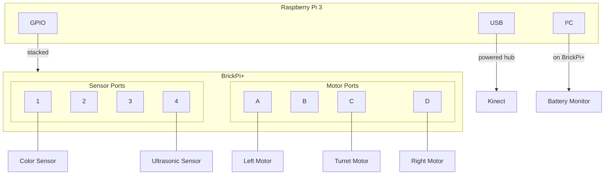

# Hardware Configuration

## Bill of Materials

| Component | Model | Purpose |
|-----------|-------|---------|
| Single Board Computer | [Raspberry Pi 3](https://www.raspberrypi.org/products/raspberry-pi-3-model-b/) | Main controller |
| Motor Controller | [BrickPi+](https://www.dexterindustries.com/brickpi/) | LEGO Mindstorms interface |
| Depth Camera | [Xbox 360 Kinect](https://en.wikipedia.org/wiki/Kinect) | RGB + depth vision |
| Robotics Kit | [LEGO 8547 Mindstorms NXT 2.0](https://www.bricklink.com/v2/catalog/catalogitem.page?S=8547-1) | Motors, sensors, structural |
| Structural Parts | [LEGO 42055 Bucket Wheel Excavator](https://www.bricklink.com/v2/catalog/catalogitem.page?S=42055-1) | Caterpillar tracks, frame |

## Motor Configuration

The robot uses three NXT motors controlled via BrickPi+:

| Motor | BrickPi Port | Function | Direction |
|-------|--------------|----------|-----------|
| Left Drive | PORT_A | Left caterpillar track | Negative = forward |
| Right Drive | PORT_D | Right caterpillar track | Positive = forward |
| Turret | PORT_C | Rotating head/camera mount | Positive = left |

### Motor Speed Notes

- Speed values range from -255 to +255
- The left and right motors are mounted in opposite orientations
- Forward motion requires: left motor negative, right motor positive

## Sensor Configuration

| Sensor | BrickPi Port | Type Constant | Output |
|--------|--------------|---------------|--------|
| Color/Light | PORT_1 | `TYPE_SENSOR_LIGHT_ON` | Reflectance value (0-1023) |
| Ultrasonic | PORT_4 | `TYPE_SENSOR_ULTRASONIC_CONT` | Distance in cm |

## Kinect Sensor

The Xbox 360 Kinect provides:

| Stream | Resolution | Format | Use |
|--------|------------|--------|-----|
| RGB Video | 640×480 | RGB24 | Visual feedback |
| Depth | 640×480 | 11-bit | Obstacle detection |
| Tilt Motor | N/A | Degrees | Camera angle (not implemented) |

### Kinect USB Requirements

The Kinect requires significant USB bandwidth. On Raspberry Pi:
- Use a powered USB hub
- Avoid other high-bandwidth USB devices
- USB 2.0 is sufficient but may limit frame rate

## Additional Sensors

### Battery Voltage (I²C)

The BrickPi+ includes an MCP3021 ADC for battery monitoring:

| Parameter | Value |
|-----------|-------|
| I²C Bus | 1 |
| I²C Address | 0x48 |
| Resolution | 10-bit |
| Conversion Ratio | 0.01818 V/step |

### CPU Temperature

Read from sysfs:
```
/sys/class/thermal/thermal_zone0/temp
```
Value is in millidegrees Celsius (divide by 1000).

## Wiring Diagram



## Raspberry Pi Configuration

### /boot/config.txt Additions

```bash
# Enable BrickPi overlay
dtoverlay=brickpi

# Set UART clock for BrickPi communication
init_uart_clock=32000000

# Enable battery monitoring (BrickPi+ only)
dtparam=brickpi_battery=okay
```

### udev Rules

Two udev rules are required:

**`/etc/udev/rules.d/55-i2c.rules`** - I²C permissions for battery monitoring

**`/etc/udev/rules.d/66-kinect.rules`** - Kinect USB permissions

These are installed automatically by `install_dependencies.sh`.

## Power Requirements

| Component | Voltage | Current (typical) |
|-----------|---------|-------------------|
| Raspberry Pi 3 | 5V | 700-1000 mA |
| BrickPi+ | 9V (battery pack) | 500-2000 mA |
| NXT Motor (×3) | Via BrickPi | 200-600 mA each |
| Kinect | 12V (separate adapter) | 1500 mA |

**Note**: The Kinect requires its own 12V power supply; it cannot be powered from USB alone.

## Troubleshooting

### BrickPi Not Responding

1. Check `/boot/config.txt` has correct overlays
2. Verify I²C is enabled: `sudo raspi-config` → Interface Options → I²C
3. Test I²C detection: `i2cdetect -y 1`

### Kinect Not Detected

1. Check USB connection and power
2. Verify udev rules are installed
3. Test with: `freenect-glview` (if available)
4. Check dmesg for USB errors: `dmesg | grep -i kinect`

### Motor Not Moving

1. Check BrickPi port connections
2. Verify motor enable flags in code
3. Test with BrickPi example scripts

